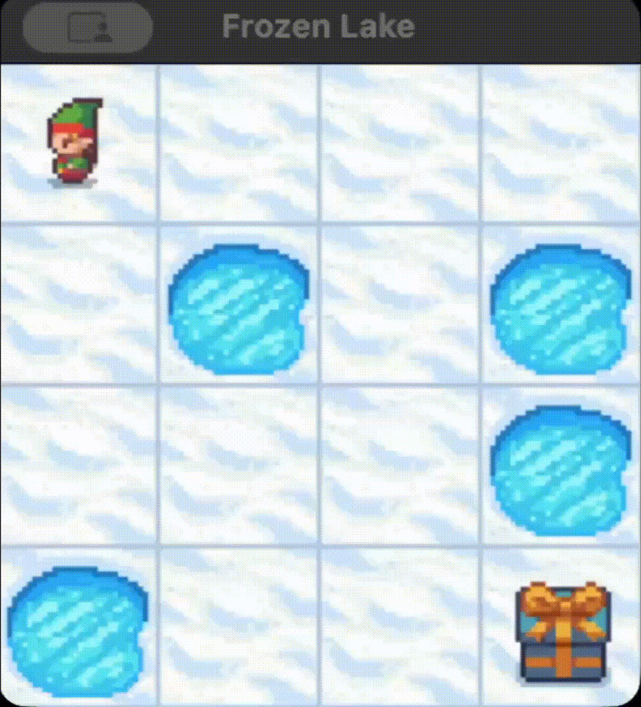

<h1 align="center">🧊 Frozen Lake: Reinforcement Learning & Evolutionary Algorithms</h1>

  
  
  

  

  

  

  

## 📌 Overview & The Environment

This repository contains a comprehensive solution for the classic **Frozen Lake** environment. The core goal of this project is to navigate an agent across a grid of slippery ice and water holes to reach a target safely without falling in.

[cite_start]In the standard configuration (`is_slippery=True`), the environment is highly stochastic: the agent only moves in the intended direction with a 33.3% probability, while the remaining 66.6% is distributed among perpendicular directions[cite: 26]. [cite_start]Due to these complex and non-deterministic transition dynamics, the project explores and compares different Artificial Intelligence approaches, specifically focusing on **Model-Free Reinforcement Learning** techniques and **Evolutionary Computing**[cite: 4, 35].

The environment is represented by a grid consisting of four types of tiles:
* [cite_start]**`S` (Start):** The safe starting point of our agent[cite: 23].
* **`F` (Frozen):** Solid ice tiles, safe to walk on.
* **`H` (Hole):** Holes in the ice. [cite_start]Stepping here terminates the episode with a reward of 0[cite: 24].
* **`G` (Goal):** The objective. [cite_start]Reaching this tile terminates the episode with a successful reward of +1[cite: 23, 24].

## 🧠 Algorithms Implemented

[cite_start]The project is modularized into different scripts, each implementing a distinct algorithmic approach[cite: 6, 33]:

| Algorithm | Type | Technical Summary |
| :--- | :--- | :--- |
| **`q_Learning.py`** | Off-Policy TD | Learns the optimal action-value function independently of the agent's current policy by assuming greedy future actions. |
| **`sarsa.py`** | On-Policy TD | Updates state-action values based on the specific action taken by the current $\epsilon$-greedy policy, leading to safer, more conservative convergence in risky environments. |
| **`montecarlo.py`** | First-Visit | Estimates the value of state-action pairs by averaging the returns obtained following the first visit to a state at the end of each full episode. |
| **`genetic.py`** | Evolutionary | [cite_start]Evolves a population of discrete deterministic policies through successive generations using tournament selection, uniform crossover, and mutation operators to maximize fitness[cite: 35]. |

## 📊 Experimental Results

[cite_start]The benchmarks below illustrate the performance of each approach when dealing with the sparse reward structure and the stochastic nature of the slippery 4x4 grid[cite: 44].

### Global Performance Comparison

After conducting 5 independent executions per algorithm (25,000 episodes for RL methods, 80 generations for the Genetic Algorithm), the evolutionary approach proved to be vastly superior in this specific environment:

  

<i><b>Figure 1:</b> Performance comparison. The Genetic Algorithm (red) achieves an ~82% success rate in under 20 generations with near-zero variance, significantly outperforming TD methods (SARSA & Q-Learning, ~49%) and Monte Carlo (~37%).</i>

## 🗺️ Learned Policies Comparison

Because the ice is slippery (`is_slippery=True`), moving in a direction has a 33.3% chance of sliding perpendicularly. This forces the algorithms to learn different survival strategies instead of just the shortest path. 

Here are the final policies learned by each agent on the 4x4 grid:

<table style="width: 100%; text-align: center; border-collapse: collapse;">
  <tr>

    <td style="width: 50%; padding: 10px;">
      

        <b>SARSA (Conservative)</b> 

        S
        ↑
        ↓
        ↑ 

        ←
        H
        →
        H 

        ↑
        ↓
        ←
        H 

        H
        →
        ↓
        G
      

    </td>

    <td style="width: 50%; padding: 10px;">
      

        <b>Q-Learning (Greedy)</b> 

        S
        ↑
        ↑
        ↑ 

        ←
        H
        →
        H 

        ↑
        ↓
        ←
        H 

        H
        ←
        ↓
        G
      

    </td>

  </tr>

  <tr>

    <td style="width: 50%; padding: 10px;">
      

        <b>Monte Carlo (Unstable)</b> 

        S
        ↑
        ←
        ↑ 

        ←
        H
        →
        H 

        ↑
        ↓
        ↓
        H 

        H
        →
        ↓
        G
      

    </td>

    <td style="width: 50%; padding: 10px;">
      

        <b>Genetic Agent (Optimal)</b> 

        S
        ↑
        ←
        ↓ 

        ←
        H
        →
        H 

        ↑
        ↓
        ←
        H 

        H
        →
        ↓
        G
      

    </td>

  </tr>
</table>

### Key Strategy Insights:
* **The Wall Strategy (Q-Learning):** Notice the top row (`↑ ↑ ↑`). The agent smartly learns to "crash" intentionally into the top wall. This prevents it from accidentally sliding down into the holes, allowing safe horizontal movement.
* **The Danger Zone (SARSA & Genetic):** At position (2,2), both algorithms choose to move Left (`←`) instead of towards the goal. This counter-intuitive, conservative move safely avoids slipping into the adjacent hole.
* **The Optimal Path (Genetic Algorithm):** The evolutionary approach quickly finds a highly efficient route, achieving over an 82% success rate, by safely navigating the top-right corner (`↓`) avoiding the infinite loops sometimes caused by conservative TD policies.

## 🚀 How to Run

To test the algorithms locally on your machine, follow these steps:

1. **Clone the repository:**
  git clone https://github.com/LuisCalvetGarcia/Frozen-Lake.git
2. **Install dependencies:**
  pip install gymnasium numpy
3. **Execute the main script**
  python main.py

## 📄 In-Depth Analysis & Results

For a deep dive into the mathematical foundations, hyperparameters tuning, and a detailed performance comparison between Q-Learning, SARSA, Monte Carlo, and Genetic Algorithms, please refer to the attached project report: Frozen_Lake.pdf.
